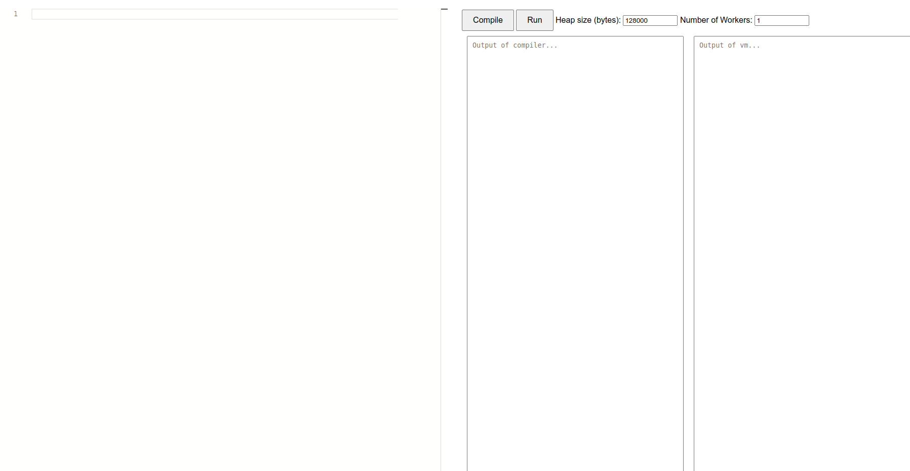

# Rust in TypeScript

## Quick Start
Visit [here](https://amadeus-winarto.github.io/rust_js/) to see the virtual machine! 

There are some known limitations however: 
- May not work with Chrome
- No syntax highlighting

For a (possibly) better experience, you can run the VM locally by following the instructions below. 

## Dependencies

### ANTLR4

To generate the parser, you need to have ANTLR4 installed. You can install it using the following command:

```bash
python3 -m pip install antlr4-tools
```

### Node.js

We use `npm` to manage the dependencies and typescript to run the code. You can install `npm` using the following command:

```bash
sudo apt install nodejs
```

We tested this code base on `node v20.11.0`.  There are known issues with `node v10`.

You can then install the dependencies using the following command:

```bash
npm install
```

To run the code, you need to have `tsx` installed. You can install it using the following command:

```bash
npm install -g tsx
```

You also need to generate the parser using the following command:

```bash
npm run gen_parser
```

## Running the code

Once you have installed all the dependencies, you can run the code using the following command:

```bash
npm run main
```

This should host the server on `localhost:8080`. Go to the browser and type `localhost:8080` to see the output. You should be able to see the following:

<figure>
  
  <figcaption>Editor on the browser</figcaption>
</figure>

## Samples

For sample source files, you can look at the `samples` directory. The `samples` directory also contains a `README.md` file that explains the sample source files.

For more information on the language, you can look at the `grammars` directory. The `grammars` directory also contains two files `Rust1_Features.md` and `Rust2_Features.md` that explain the features of the language as well as differences with standard Rust.
